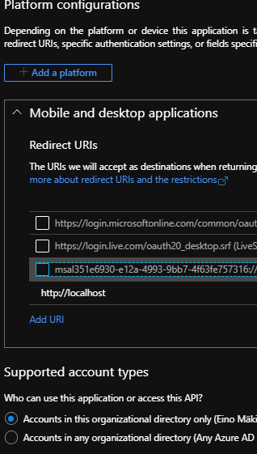
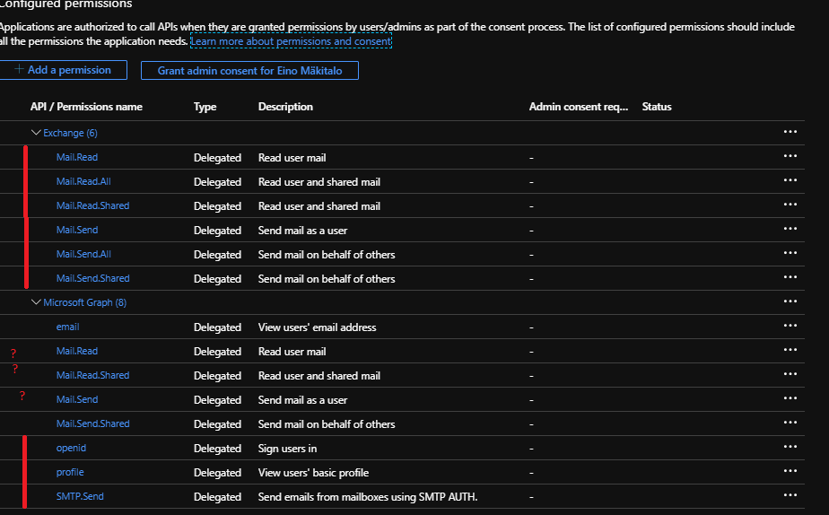

# Example of javax.mail and Office 365 and SMTP send with OAUTH / XOAUTH2

This program is an exampl of javax.mail and Office 365 and SMTP send with OAUTH / XOAUTH2. We ask user to log in and then
we get access token and refresh token.  I just use access token. 

This program is for Desktop applications made with Java but no UI here just 
proof of concept.

It uses XOAUTH2 authentication to send email
It should work event with MFA

Remember to create file
config.properties (in main/resources)
copy config_example.properties you need

##Register  applicaton in Azuze
Go Azure https://portal.azure.com
and there [App Registrations](https://portal.azure.com/#blade/Microsoft_AAD_RegisteredApps/ApplicationsListBlade)

Here you have to create new app for your desktop app

###Go   page
In Authentication page 

### Go  page
In Api permission page you should give read permissions maybe also question marks.

I'm using SMTP but Microsoft recommends Graph API.  

To respect [Jon Postel](https://en.wikipedia.org/wiki/Jon_Postel) I prefer STMP :-)

TODO:
 * create token cache real so that it's not asking password every time
 
 
Sources:
 https://docs.microsoft.com/en-us/exchange/client-developer/legacy-protocols/how-to-authenticate-an-imap-pop-smtp-application-by-using-oauth#register-your-application
 

